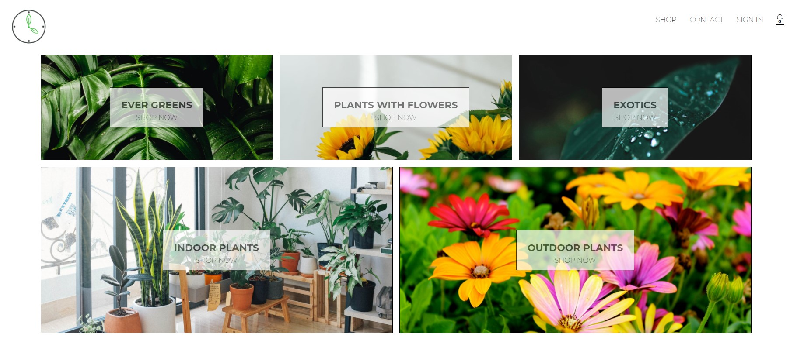

# Flower Time
A simple plants online store.

# Inspiration
I wanted to learn how to make React.js web apps.

The app architecture/structure is mostly based on ideas I've seen in the Complete React Development course on Udemy.com and plants.com. 

# Development stack
+ [React.js](https://reactjs.org/)
+ [React Router](https://reactrouter.com/)
+ I used [Firebase](https://firebase.google.com/) as my Database and user authentification.
+ I used [Stipe](https://stripe.com/) to process user payments and orders.
+ I used git for version control, and stored progress on GitHub.
+ Currently only tested on an iOS device

# APIs
+ Payment processing was implemented using Stripe (https://stripe.com/)

# External packages
+ [react-redux]
+ [react-router-dom]
+ [reselect]
+ [styled-components]

# Current progress
- [x] App skeleton
- [x] Basic UI prototype
- [x] Create main page
- [x] Create Log in and Sign in Forms and Page
- [x] Create first actions, reducers
- [x] Implement Firebase authentification
- [x] Add products page
- [x] Add cart page
- [x] Implement Redux
- [x] Implement Stripe payments
- [x] Move data to Firebase
- [ ] Finish Stripe payments implementation
- [ ] Add Hooks
- [ ] Add GraphQL
- [ ] Implement Admin page
- [ ] Create more products
- [ ] Remove extra code and fix typos
- [ ] Add support for mobile devices

# Running

## Clone & install

+ Clone this repo `git@github.com:dieterhalosta/flower_time.git`
+ `cd flower_time`
+ run `npm install`

## API keys
+ Get your API key from https://firebase.google.com/
+ Get your API key from https://stripe.com/

## License

Released under the [MIT License](http://opensource.org/licenses/MIT).

# Feedback

Feedback is always welcome. Feel free to contact me, I would love to know if you notice something that can be done better.
